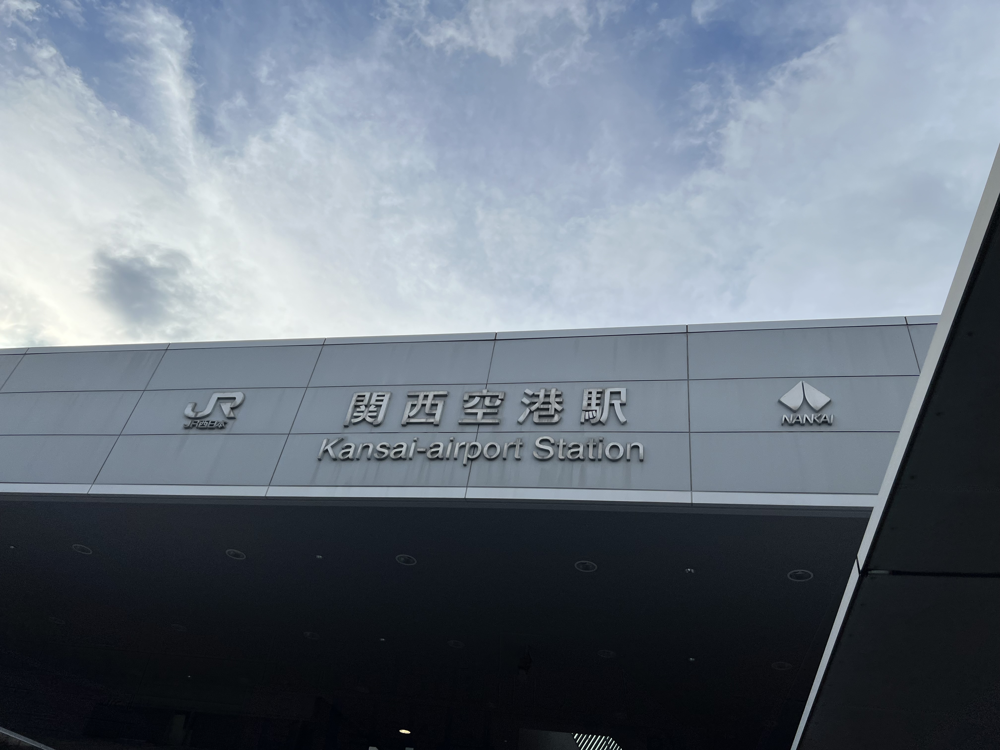
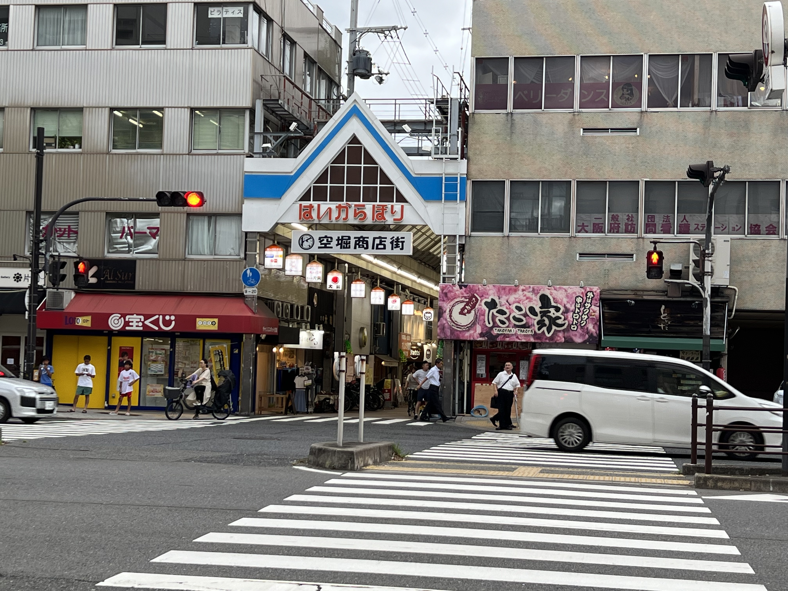
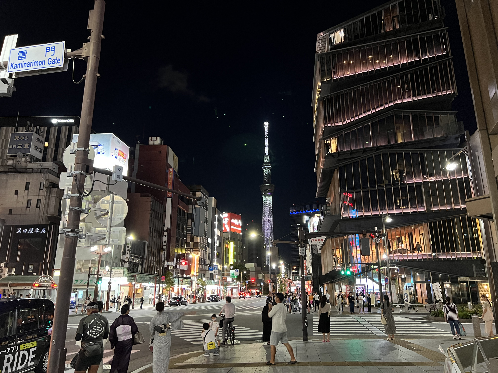
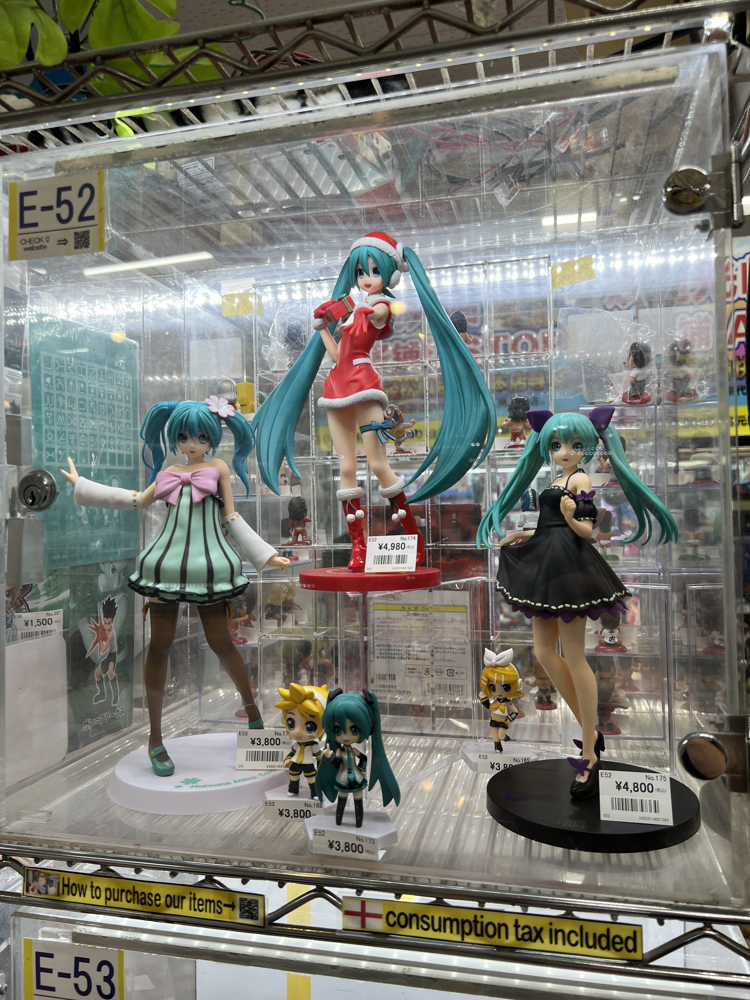
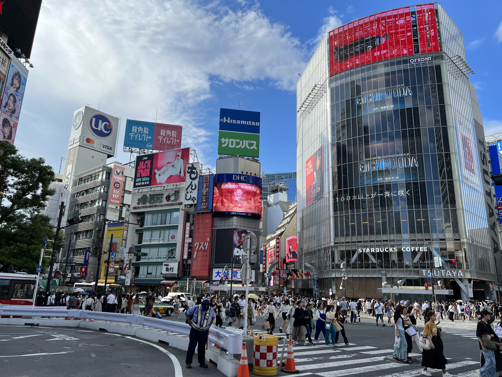
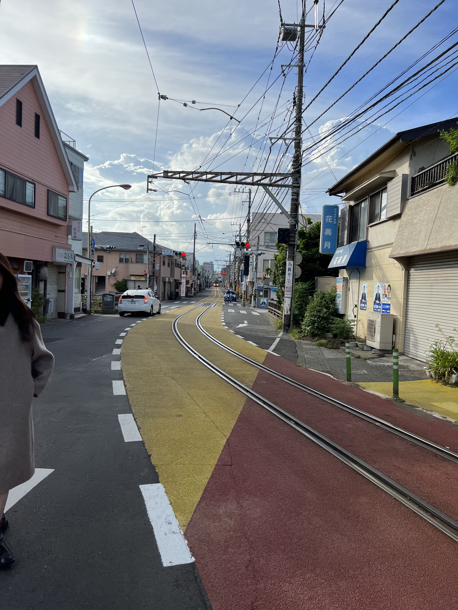

> 小小记录一下。
>
> 1. 因为人已经回来很久了，博客里的照片都是带GPS等exif信息的，方便以后看地方；
> 2. 这里放了很多很多图，小心流量；
> 3. 由于博客不方便上传太大的图片，这儿都是压缩处理过一遍的jpg，有看中哪张图想要原图的戳我；

## 序曲

本科毕业的时候（就上半年），我攒了一点钱，打算毕业的时候多去几个地方玩一玩，好好来场毕业旅行。但是毕设加上一堆乱七八糟的事，还有填坑的原因，这笔钱没花出去，也没玩几个地方，就和董叔去汉中逛了两天。然后是浑浑噩噩的暑假，去苏州参加了一场比赛，然后开始每天按部就班的练科二。直到暑假的尾巴，才想起来这本科都毕业了，还没玩呢。

早在五月的时候，有个玩的很好的高中同学（下文称他阳哥）问我，要不要去日本玩一圈，他存了一笔钱，带我。

> 👴：有这好事？👴马上就去办护照签证。

然后就真去办了护照，到暑假过了1/4才想起来。然后我俩开始折腾签证的事，最后找了家晦气旅行社，来回机票加签证坑了我俩一人5k，给这事定下来了。

走之前，我问他，咋走，

> 阳哥：别急，咱先去西安住几天。
>
> 👴：❓
>
> 阳哥：我有个玩伴之前找我借了点钱，咱去给钱要到就去日本。
>
> 👴：还有这事？

然后我俩就跑到西安，定了五天酒店，刷完了双人成行，开了一个MC整合包，通关了森林之子。

然后临走了，我问他：

> 👴：要到帐了🐴？
>
> 阳哥：借了2w，要回来2k。
>
> 👴：？
>
> 👴：你身上多少钱？
>
> 阳哥翻出钱包，掏出里面的10w日元（5k rmb）
>
> 👴：👴身上就1w rmb，还去不去？
>
> 阳哥：走。
>
> 👴：走，大不了学杀酱0元城市生存15天。
>
> 阳哥：？
>
> 阳哥：我觉得我把你肾卖了比较好。
>
> 👴：😡👊

## 北京 ✈️ 关西 🚄 大阪

### 08-22 到达

​​

阳哥是第一次坐飞机，但是他刚熬了一宿，上飞机就睡死了，连起飞的推背感都没叫醒他。

​​​​

​​

​​

到了关西。

接下来去大阪，先买票。阳哥不会讲洋文，👴自认为洋文还不错，就操着一口Chinglish上了。对着售票员比划了半天，她问我：Chinese？👴：yes yes。然后售票员操着一口比我还标准的普通话给我讲怎么买，给我把业务办完了。

> 在外面等的阳哥：搞好了咩？
>
> 👴：得现金付，搞好了，但是是七天通票，没买今天的，今天还得买单程票。
>
> 阳哥：草，那你再去跟她交涉交涉？
>
> 👴：她中国话讲得比你好。
>
> 阳哥：？
>
> 阳哥：那剩下的钱呢？
>
> 👴：？什么钱？
>
> 阳哥：我给了你7w日元啊
>
> 👴挥了挥手里两张日本铁路全国通票：都在这儿了
>
> 阳哥：草

​​

买了票，进了站，👴🚪迷茫了，坐哪个车？

可惜站内的保安不会中国话，👴用英语问他怎么去Osaka，他叽里呱啦说了一堆明显听起来不是日语但是又不像是英语的东西，见我愣住了，于是开始张牙舞爪的比划，然后嘴里说you take 哈鲁卡 哈鲁卡，👴还是一脸懵b，直到看到了他指着一辆列车：哈鲁卡！

​​

草。

后来道谢的时候我本来脱口而出的thank you又憋了回去，换成了阿里嘎多阔赛伊马斯。

​​

于是👴🚪坐着关西空港特急希望（Haruka）号到了大阪。

​​​​

坐JR坐到大阪天王寺，然后俩人又迷失在霓虹的奇妙交通里了。在地铁站里兜兜转转走了一圈又一圈还没弄明白这地铁咋坐的，这JR、Metro、近铁、单营、电车轨道都是什么玩意儿？转了一圈又一圈，还上错一趟车，最后总算是到了Airbnb订的民宿。

​ ​​

再便宜的日本民宿都必备的微波炉和浴缸。

放了行李，简单休息了一下，该吃晚饭了。外卖不知道怎么点，大众点评翻了一下附近4000円起步，想着拉倒吧不如出去找找小馆子钻一钻。这么想着，我俩就去街上晃悠了。晃了一圈没找到啥好吃的，于是挑了一家人还挺多的店进去，

​​​​

一看菜单东北料理：

​​​​

番茄酱炒番茄，谁想出来的玩意儿。

​​​​​​

这抄馓子味道还不错其实。（阳哥：你来日本吃中餐❓  👴：那你来想吃啥。  阳哥：我觉得中餐也不错）

吃完饭，逛了逛附近，找着好几家711，进去一看一只卡芙卡坐在货架上。

​​​​

​​​​

晚上回去想起来人都在日本了，啤酒烧烤启动！

​​

算了，打不了一点。

收拾收拾泡个澡差不多凌晨一两点了，刚说完睡觉，就听见阳哥的鼾声已经起来了。于是倒头就睡，睡到第二天上午十一点，一睁眼就是窗外整整齐齐一排垃圾。

​​

> 阳哥：你也去下面趴着
>
> 👴：❓

### 08-23 天守阁和鳗鱼饭

霓虹是靠左通行的，过马路时人不让车，司机大老远看见你有过马路的意向就会直接停下来等你过去，如果跟国内一样站着等司机开车过去的话，会尬住很长一段时间，最后还得是你先过马路，不然司机会按喇叭催你。头几天还不太习惯，后面几天看到路口我都是直接走的。（后遗症是回国了之后在北京这么走差点被京爷创死）

​​

​​

天守阁所在的大阪城公园离我们住的地方非常近，不到一公里。

​​

​​​​

满地的咕咕咕也不怎么怕人，买了个热狗卷被鸽子啄了一半。

​​

​​

​​

> 阳哥：天守阁怎么都装电梯了
>
> 👴：方便你上去捡雷神瞳
>
> 阳哥：❓

塔尖好像少了点什么，这样才河里：

​​

> 👴：你上去跟她对一刀？没事，我给你护照带回去，多少给你封个烈士
>
> 阳哥：你咋不去
>
> 👴：你看我这风神之眼还没亮呢，得先给你献祭了才行
>
> 阳哥：❓

转完回去想起来我带着电脑，刚准备打开发现霓虹插座标准跟国内不一样，看了眼时间还早，阳哥不想动弹，我就自己出去在大阪街上乱晃悠，到处找店问有没有卖转接线的。

​​

发现一个商店街，很有玉子市场既视感。

​​

​​

兜兜转转从谷町-4转到了谷町-6，终于找到一家电工商店，花了1400円买了一根破破旧旧还没有接地的线。

回去之后，我俩合计着出去吃鳗鱼饭。

​​

挺好吃，就是量太少了。

晚上回去路过711，进去买了一瓶这个：

​​

说是改善睡眠质量，实际上就是酸奶，喝了感觉没啥用，但睡的还是不错。

## 大阪 🚄 东京

### 08-24 东京和深夜动画

在大阪只有天守阁一个打卡点，环球影城因为太远了就算了，我们两个啥b二次元就是来打卡的。于是24号JR全国通票生效的时候，我俩就打算去东京了。

​​

走的时候赶上了早高峰末潮，地铁上人不少，但是安静得可怕。

> 👴：……
>
> 阳哥：……
>
> 👴：你怎么这么有素质了
>
> 阳哥：❓

​​

​​

​​

​​

日本的云是真的好看，一块儿天空上各种类型的云都齐活了，看起来真的感觉云上还有一片陆地，还有一个国家。

然后到了东京：

​​

​​

在东京民宿的电视上翻到了MyGO！和赛马娘，

​​

果断点了个预约。

​​

​​

​​

​​

晚上想着出去吃点啥，一出门就看见了天空树，作为地标建筑真的好看：

​​

在大众点评上找了家和牛，想着奢侈一把，结果店家可能知道我俩没几个钱，今天不开业：

​​​​

最后去吃拉面了。吃前忘记拍了，吃完了拍一张：

​​

> 👴：你觉得这面正宗🐴
>
> 阳哥：我又不是本地人，我咋知道
>
> 👴：你不是本地人❓
>
> 阳哥：❓
>
> 👴：我不好说，这面跟西电那家日式豚骨拉面一个味儿
>
> 阳哥：西电东京分校是吧

晚上啤酒烧烤时间。

​​

主打一个全靠带。

### 08-25 浅草寺 - 秋叶原 - 天空树

浅草寺人挺多，有不少求御守的。

> 👴：求一个？
>
> 阳哥：不如回去拜孙悟空

​​

> 👴：中午吃啥
>
> 阳哥：我不到啊
>
> 👴：我也不到啊
>
> 阳哥：mcd吃不吃
>
> 👴：你来日本就吃mcd❓
>
> 阳哥：你来日本还吃中餐呢

​​

吃完午饭就该去秋叶原了，二次元天堂！

结果还没到秋叶原呢，路边看到了个二次元牌子，以为是什么展览，凑近一看：

​​

​​

好家伙，消防队。

路上看到不少很二次元的店，这个好像是女仆咖啡厅：

​​

悄悄Google了一下价格，没敢进去。

然后到了秋叶原。

​​

> 👴：怎么全是原神方舟星穹铁道

让bocchi酱站这儿属实太难为社恐了

​​

整点专辑带回去：

​

​​​

​​

我超，________！

​​

来霓虹不进机厅的人生是失败的：

​​

没带手套，手搓疼了。

一天的战利品：

​​

> 阳哥：你在日本买国内游戏周边❓
>
> 👴：可这是 Sweets Paradise 联名欸，国内又不卖
>
> 阳哥：sb二次元
>
> 👴：你给你手办扔了再说话

晚上随便对付了两口，打算去天空树。

> 阳哥：看看地图咋走
>
> 👴：还用看地图？你看天上那个一直发光的是啥

​​

看着好像挺近的，给我俩腿都快走断了。

​​

​​

登塔要1200円的门票，由于在大晚上顶层不开放，只能坐到350m高的中层。

一眼望不到边际的城市，太震撼了。

​​

上面还设了一个许愿台

​​

买了根带子，这布条上写字太难写了。

​​

### 08-26 明治神宫 - 涩谷 - 新宿 - 下北泽

今天约了一个在日本留学的高中同学一起，大概早上十点左右出发的，接近中午的时候到了明治神宫站。

去明治神宫的路上，坐地铁看到了一堆熟悉的番，似乎是卡牌游戏联动：

​​

看到了很有钱的二次元（羡慕死了）

​​

刚出地铁站，就听见外面震天响，原来是有露天表演：

​​

本来应该先去明治神宫打个卡的，但是饿了，于是去了一个很二次元的街道

​​

​​

然后找到了一家和牛店。

​​

> 👴：我测，时薪65RMB，不要工作经验不要简历，会笑就行？
>
> 阳哥：我测

​​

​​

我跟牛聊两句都比这个熟.jpg

吃了正宗的日本和牛感觉其实也就那样，也可能是我山猪吃不了细糠。生肉口感怪怪的，希望第二天不会拉肚子（确实没拉）。

然后是明治神宫：

​​

​​

路上见到了一只巨大的乌鸦，而且不怕人：

​​

本来想摸摸来着，但是它好像很有敌意，就没敢碰它。

> 阳哥：乌鸦又不是啥好东西
>
> 👴：乌鸦在日本的含义好像是翻过来的，代表好运
>
> 阳哥：你小心它跟你屁股后面飞回国，就不是好运了
>
> 👴：❓

​​

从明治神宫出来往北，到了一个很著名的高档餐厅 [LA TABLE de Joël Robuchon](https://www.robuchon.jp/en/shop-list/latable)

​​

​​

在外面拍了两张照就跑了。

听说这餐厅得提前好久预约，花销不是一般人能负担的。

很繁华的涩谷：

​​

本来想去最高的那层楼看看，但是今天不开放，于是作罢，直接奔着下北泽去了。

​​

下北泽！

​​

本多剧场！

​​

​​

​​

‍

​​

​​

晚上去了歌舞伎厅一番街：

​​

腿都要逛断了。

> 阳哥：腿快断了
>
> 👴：别啊，明天还要去七里浜呢
>
> 阳哥：你自己去，我动不了了
>
> 👴：❓麻衣学姐你都不去看看❓
>
> 阳哥：我又没看过那番
>
> 👴：❓你是不是二次元啊
>
> 阳哥：啥B二次元
>
> 👴：😡👊

​​

### 08-27 镰仓 - 七里浜 - 踢你的肾（不是

因为阳哥实在不想动，我就一个人出发了。坐中央-总武线到镰仓，然后再坐江之岛电铁去七里浜。

​​

我是从新日本桥上的车，然后听见车到东京了，觉得自己没坐错方向。结果坐了几站之后发现自己到了一个什么什么町站？草，这趟车到东京之后又掉头开回去了！

最终折腾了几趟，终于坐对了车，来到了镰仓。

​​

江之岛电铁上人挤人，排了两趟车才挤上去。

然后到了七里浜

​​

​​​​

七里浜站出来，旁边就是学姐的学校

​​

可惜不让进，不过还是能看到一点教学楼和操场。

从七里浜站往前走，就是那个沙滩：

​​

内陆孩子这辈子第一次实际意义上的见大海，没想到是在这里。

​​

远处的江之岛：

​​

我从七里浜下车，沿着电铁线和海边慢慢往藤泽方向走，一路上打卡了很多经典场景。

学姐拍广告的地方：

​​

​​

踢你的肾（不是

​​

电铁在马路中央开：

​​

藤泽站：

​​

想在藤泽市找找学姐住的地方和那个“击股之交”的健身器材场，可惜对着番剧和地图找了一大圈，没找到。

于是回去了。

路上看到了天空树在云层上面发出的光。

​​

公园里有很多人在聚团玩烟花。

​​

## 东京 🚄 京都

### 08-28 京都 - 清水寺

一早就收拾东西退房去京都了。

​​

​​

还有马厩：

​​

给父母买了点纪念品

​​

还尝了尝抹茶

​​

感觉……不好喝。

很像天气之子，立体感很强的云：

​​

叫蒟蒻的糖：

​​

可惜去的时候太晚了，御守并没有求到，打算第二天再去。

### 08-29 还是清水寺

先去吃了个午饭，好像是什么什么面：

​​

结果尝了一口面，什么味道也没有，又尝了一口右下角碗里的汤，差点给我齁死，然后才恍然大悟，好像是蘸着面吃的。

还挺好吃。

​​

听说喝了会宾周发光的日本生可乐：

​​

喝完了没感觉出来和普通的可乐有什么区别，碳酸气更足了（？）

求了几个御守，回来的时候打算去吃咖喱饭，路上的晚霞很好看：

​​

草，强迫症要犯了

​​

日本咖喱真不错：

​​

三彩团子：

​​

## 京都 🚄 大阪 🚄 关西 ✈️ 回国

是时候回到社会主义的怀抱了。

​​

‍
